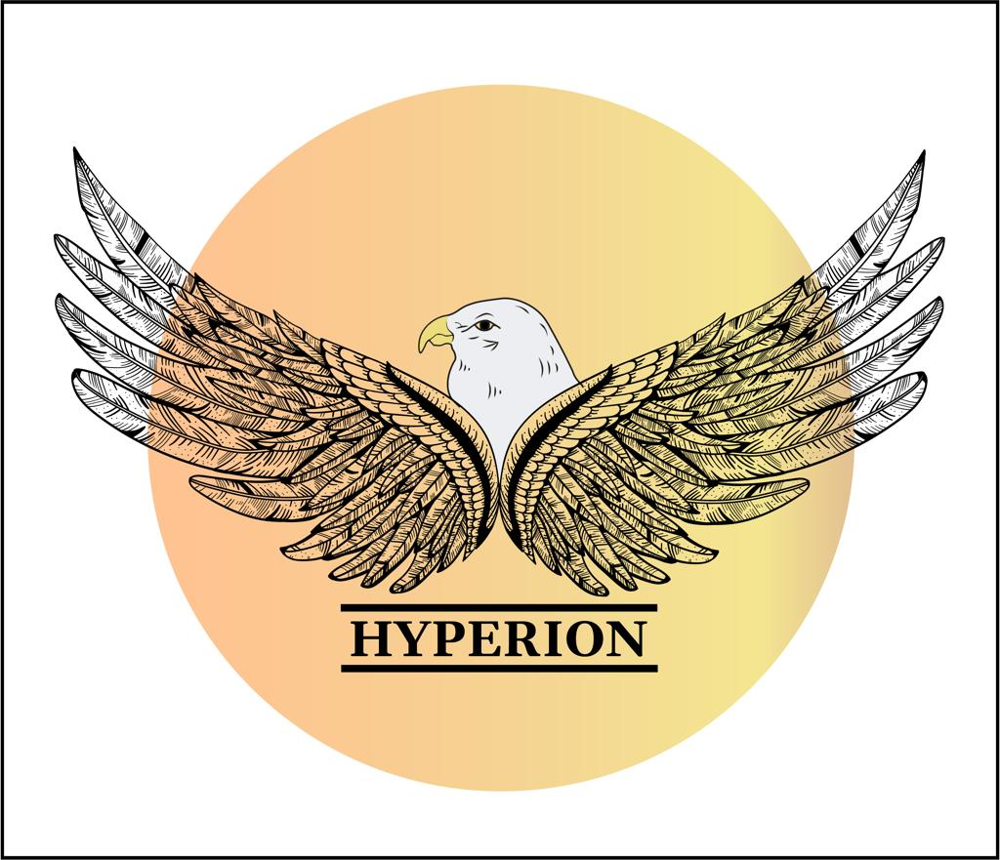
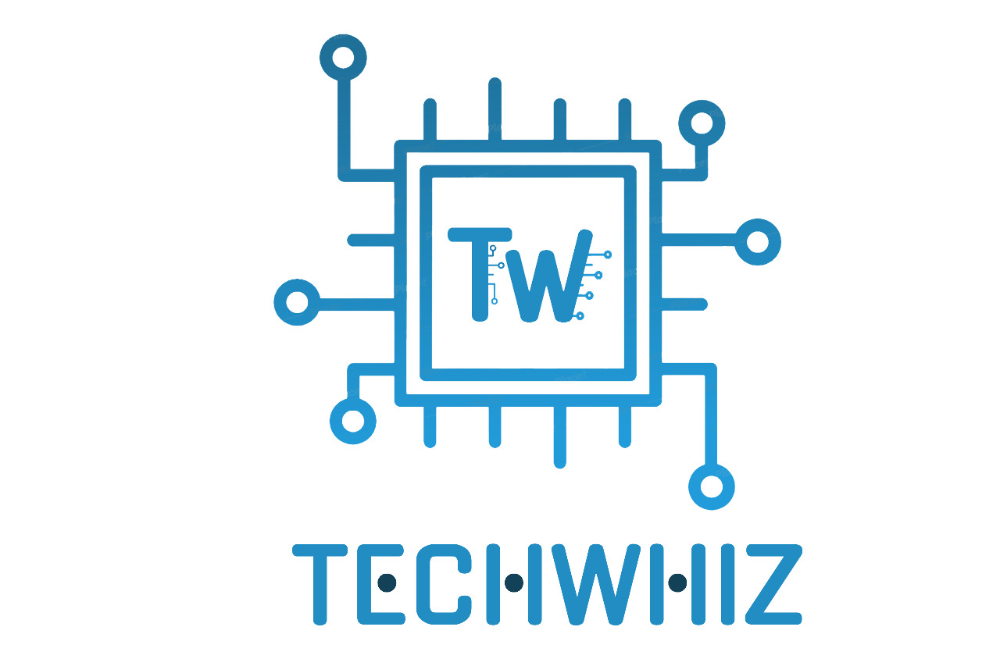

# 🎭 Hyperion – Cultural Society Website

<p align="center">
  
</p>

<p align="center">
  <strong>Official website of Hyperion – The Cultural Society of P.G.D.A.V College (M)</strong>
</p>

<p align="center">
  <a href="https://opensource.org/licenses/MIT">
    
  </a>
  <a href="https://github.com/techwhizpgdav/Hyperion/stargazers">
    
  </a>
  <a href="https://github.com/techwhizpgdav/Hyperion/issues">
    
  </a>
</p>

---

## 🌐 Live Website

🚀 **Live Demo:** https://hyperion-l84j.onrender.com/

---

## 📌 About Hyperion

**Hyperion** is the official cultural society of **P.G.D.A.V College (M), University of Delhi**.  
It functions as a constituent unit of the **Cultural Council of Delhi University** and serves as the **umbrella society** that brings together all cultural societies of the college under one platform.

The website acts as a digital hub to showcase:
- Cultural activities
- Student societies
- Core teams
- Events & galleries  
while reflecting the vibrant cultural spirit of the institution.

---

## 💡 Born from Innovation

This project is proudly developed by **TechWhiz**, the technical society of Hyperion.

The TechWhiz team transformed Hyperion’s vision into a modern, scalable, and user‑friendly digital experience using **Node.js, Express, and Handlebars**, ensuring both performance and maintainability.

---

## ✨ Key Features

- ⚙️ **Node.js & Express** powered backend
- 🎨 **Handlebars (HBS)** templating engine
- 📱 Fully **responsive design**
- 🏛️ Showcases **12+ cultural societies**
- 👥 Dedicated pages for **core teams & faculty**
- 🖼️ Dynamic **gallery section**
- 🔐 Clean routing & static asset handling
- 🚀 Deployed on **Render**

---

## 🛠️ Tech Stack

- **Backend:** Node.js, Express.js  
- **Templating:** Handlebars (HBS)  
- **Frontend:** HTML5, CSS3, JavaScript, jQuery  
- **Hosting:** Render  
- **Version Control:** Git & GitHub  

---

## 📂 Project Structure (Simplified)

```
Hyperion/
├── static/
│   ├── css/
│   ├── js/
│   ├── logos/
│   └── images/
├── routes/
├── views/
│   ├── layouts/
│   └── *.handlebars
├── server.js
├── package.json
└── README.md
```

---

## ⚙️ Installation & Setup

Follow these steps to run the project locally:

### 1️⃣ Clone the repository
```bash
git clone https://github.com/techwhizpgdav/Hyperion.git
cd Hyperion
```

### 2️⃣ Install dependencies
```bash
npm install
```

### 3️⃣ Start the server
```bash
npm start
```

The application will run at:
```
http://localhost:3000
```

---

## 🤝 Connect With Us

Stay connected with Hyperion through our official channels:

- 🌐 **Website:** https://hyperion-l84j.onrender.com/
- 📸 **Instagram:** https://www.instagram.com/hyperion_pgdav/

We welcome collaborations, feedback, and contributions from the community.

---

## 🏫 Associated Societies & Logos

<p align="center">
  
  &nbsp;&nbsp;
  
  &nbsp;&nbsp;
  
</p>

---

## 📜 License

This project is licensed under the **MIT License**.  
Feel free to use, modify, and distribute with proper attribution.

---

### ⭐ If you like this project, consider giving it a star on GitHub!
